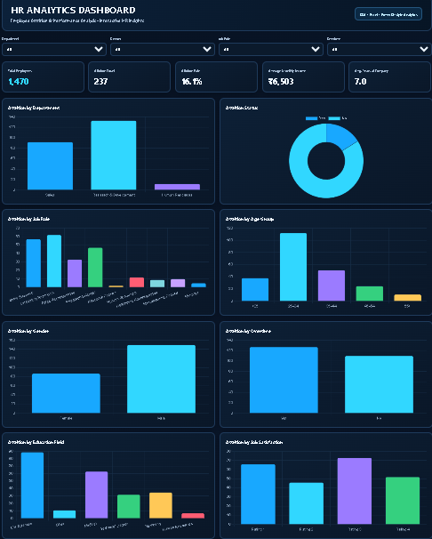
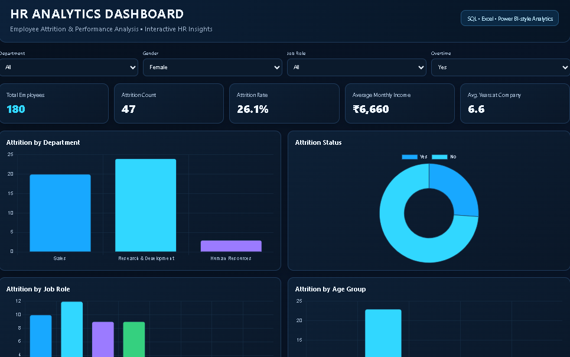

<h1 align="center">👩‍💼 Enterprise HR Analytics Dashboard</h1>

<p align="center">
  
  
  
  
  
</p>

<p align="center">
An interactive HR Analytics dashboard analyzing employee attrition and workforce performance across 1,470 employee records — built to demonstrate SQL, data analysis, and front-end dashboard development for a Data Analyst / BI Analyst portfolio.
</p>

<p align="center">
  <a href="https://manasvi-3009.github.io/HR-Analytics-Dashboard/"><b>🔗 View Live Dashboard</b></a>
</p>

---

## 📌 Project Overview

Employee attrition is a costly, recurring problem for HR teams — replacing an employee is expensive, and losing experienced staff hurts team performance. This project analyzes an employee dataset to surface **where and why attrition is happening**, using an interactive dashboard instead of static reports.

## 🎯 Business Objective

Help HR teams answer:
- Which departments and job roles have the highest attrition?
- Does overtime meaningfully affect attrition?
- How do age, gender, and job satisfaction relate to attrition?
- How does income and tenure compare between employees who stay and those who leave?

## 📊 Key KPIs

- Total Employees
- Attrition Count
- Attrition Rate
- Average Monthly Income
- Average Years at Company

## 📈 Dashboard Features

- Filters: Department, Gender, Job Role, Overtime
- Attrition by Department, Job Role, Age Group, Gender, Overtime, Education Field, Job Satisfaction
- Dynamic KPI cards that recalculate with filters
- Fully interactive charts (Chart.js)

## 🛠️ Tech Stack

| Layer | Tools |
|---|---|
| Data Analysis | SQL, MySQL |
| Data Prep | Excel |
| Dashboard | HTML, JavaScript, Chart.js |
| Hosting | GitHub Pages |
| Version Control | Git & GitHub |

## 📁 Project Structure

```
Enterprise-HR-Analytics-Dashboard
│
├── 01_BRD                → Business Requirement Document
├── 02_ER_Diagram         → Entity-relationship diagram
├── 03_Data_Dictionary    → Column-level definitions
├── 04_Dataset            → Employee dataset (1,470 records)
├── 05_SQL                → Analysis queries
├── 06_PowerBI            → Supplementary Power BI file (if applicable)
├── 07_Documentation      → Supporting write-ups
├── 08_Presentation       → Project walkthrough deck
├── 09_Images             → Dashboard screenshots (used below)
├── index.html            → Live dashboard source
└── README.md
```

## 🖼️ Dashboard Preview

**Default view**


**Filtered view — Department = Sales**


## 🔎 Key Insights

- Attrition varies meaningfully across departments and job roles — some roles show disproportionately higher turnover
- Overtime shows a visible relationship with attrition, worth flagging to HR for workload review
- Job satisfaction and tenure trends highlight where retention efforts could be targeted
- Age and gender breakdowns give a fuller picture of who is leaving, not just how many

## 🚀 Future Enhancements

Not yet implemented — listed here for transparency:
- Employee attrition prediction using Machine Learning
- Employee risk scoring
- Employee segmentation
- Automated HR alerts
- Cloud deployment / real-time data refresh

## 👩‍💻 Author

**Manasvi Vats**
B.Tech, Artificial Intelligence — Aspiring Data Analyst

- LinkedIn: [manasvi-vats-3a2421315](https://www.linkedin.com/in/manasvi-vats-3a2421315)
- GitHub: [@manasvi-3009](https://github.com/manasvi-3009)

---
*Dataset used is a publicly available employee attrition dataset, used here for educational and portfolio purposes only.*